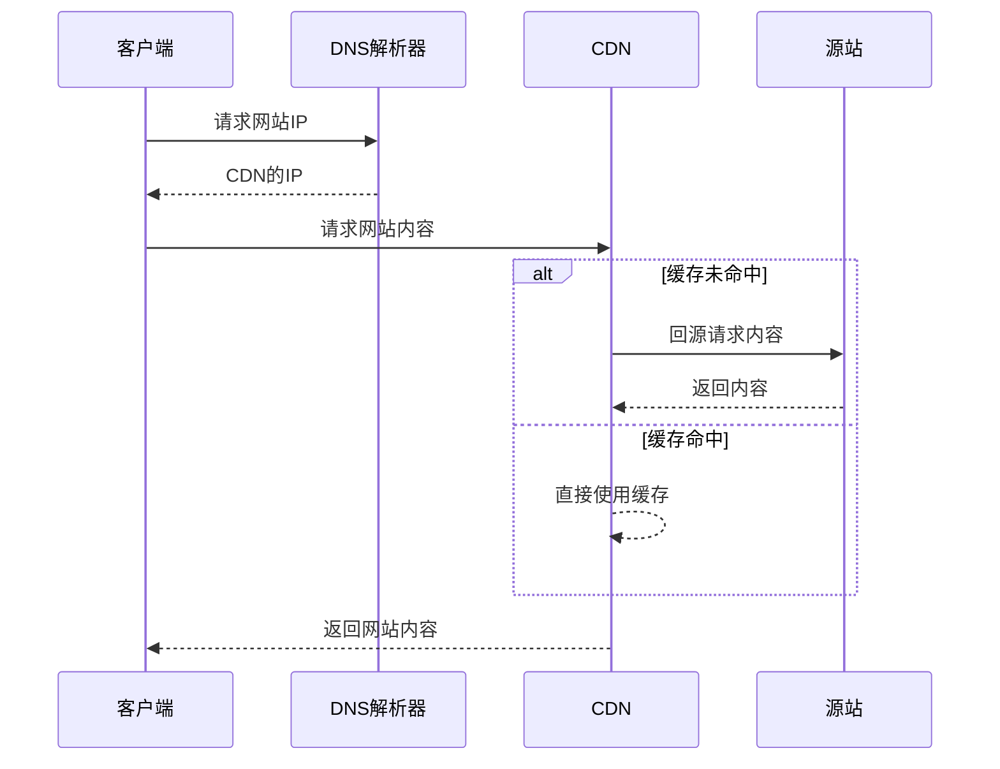

+++
date = '2026-06-07T16:13:01+08:00'
title = 'cdn'
+++

## 关于cdn
cdn(即*Content Delivery Network*，中文名称为*内容分发网络*)，我们可以理解为类似于京东的分布式仓库，cdn厂商会将你的网站的内容保存在cdn的边缘节点之上，以实现加速访问和隐藏源站防范DDOS攻击的目的。

目前国际上最大的cdn公司为Cloudflare（本网站也同样使用其cdn服务），本文主要会基于Cloudflare的cdn服务进行讲解，也会有一些国内的cdn厂商（如腾讯云的EO和阿里云的ESA，我同样使用他们）。

## cdn的实现过程

一般来说，cdn的实现由下面几个过程组成。

### 1. cdn公司的任播
cdn公司一般掌握着很多IP地址或地址段（这里主要涉及IPv4，因为IPv6地址的掌握难度较低），同时，cdn会任播他的IP地址（任播的意思是多个机器同时宣称自己有相同的IP）。

比如dns就是采取任播技术，当我们向谷歌的8.8.8.8或Cloudflare的1.1.1.1查询网站的IP地址时，我们显然不会远跨大洋去询问他们位于美国的服务器，而是就近访问同样宣称自己是8.8.8.8（或者1.1.1.1）的节点完成dns查询。

在我们理解了dns的工作原理之后，我们理解cdn的任播也就很简单了，cdn节点同样会任播一个相同的IP地址，客户端访问任何一个节点均可以实现连接（实际上会更复杂一些）。  

### 2.cdn公司的解析控制
实际上cdn公司不仅仅是通过任播IP来进行内容分发放的，这当中有一些很有意思的事情。

比如说客户端试图访问本网站（https://www.ouransishen.cn），dns解析是会显示由Cloudflare作为权威解析者（这里作为例子，实际上本网站的配置会更加复杂一些）。在此之后，通过询问Cloudflare的解析器，Cloudflare会针对性的给你他的IP地址而非我们源站的IP地址，客户端访问Cloudflare的边缘节点而非我们的源站，由Cloudflare的边缘节点访问我们的源站。

### 3.cdn访问源站
在我们成功访问到cdn的边缘节点后，边缘节点会查询自己是否有网站的缓存记录。如果有，会直接返回边缘节点的记录无须回源；如果没有，cdn会代替客户端进行回源实现（不一定是被访问的边缘节点，更可能的是距离源站较近的边缘节点回源）。

以下是cdn的工作全过程

## cdn的使用
使用cdn服务大致有两种方法，CHAME接入NS接入。

### CHAME接入过程
当使用比如腾讯云EO或者阿里云ESA这些较为宽泛的cdn时，他们会给你一个域名，你需要在你的域名解析处增加一个CHAME记录，将域名指向cdn的域名。完成之后，对网站的访问将被导向cdn的边缘节点。

### NS接入过程
NS接入实际上就是cdn厂商也是你的域名解析者（比如Cloudflare）。这时候我们不需要单独配置CHAME记录，在配置A记录后，Cloudflare会自己返回一个他的IP地址。